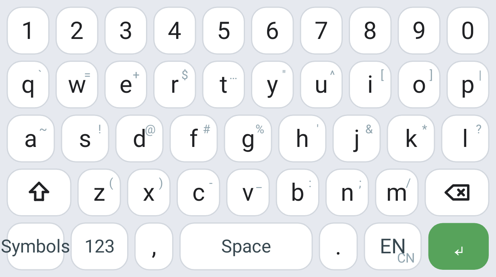
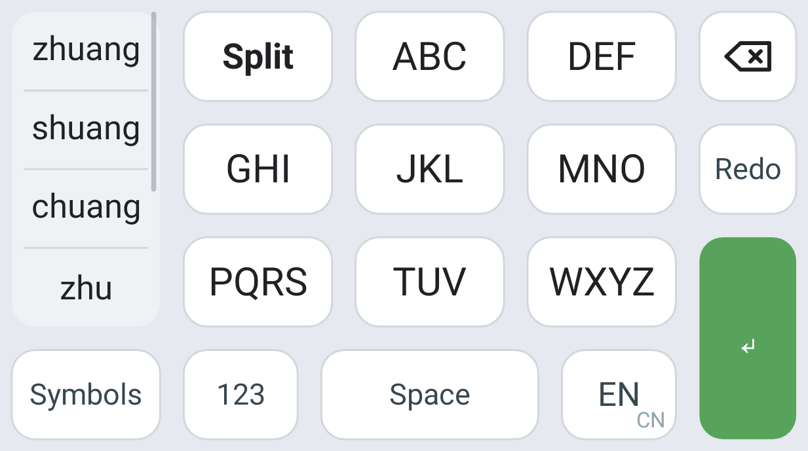
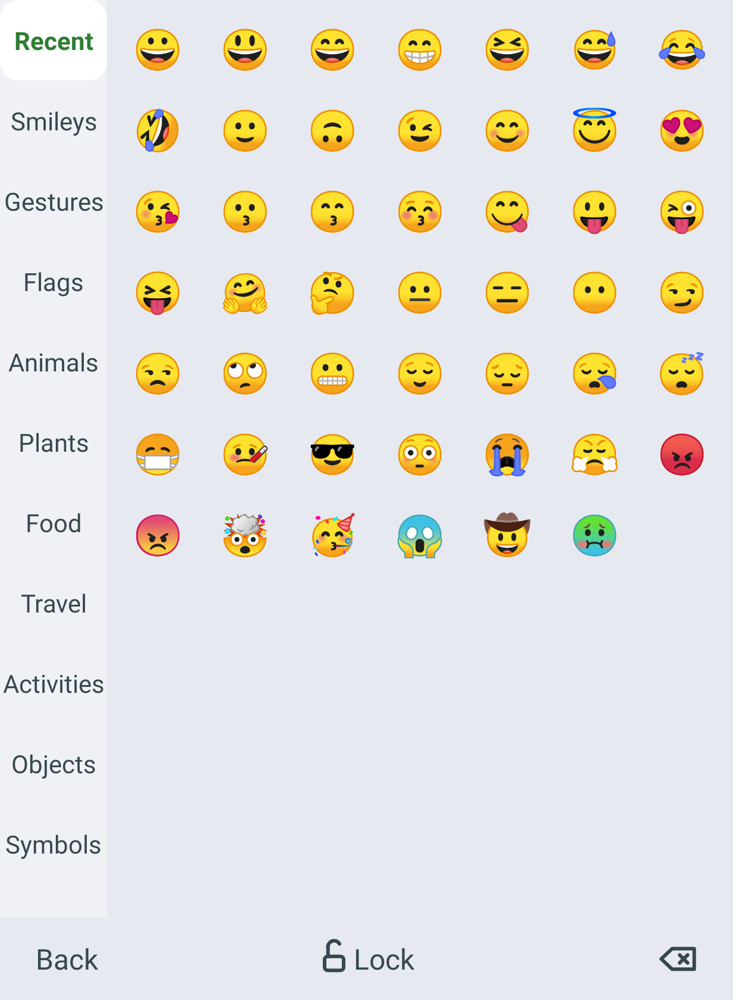
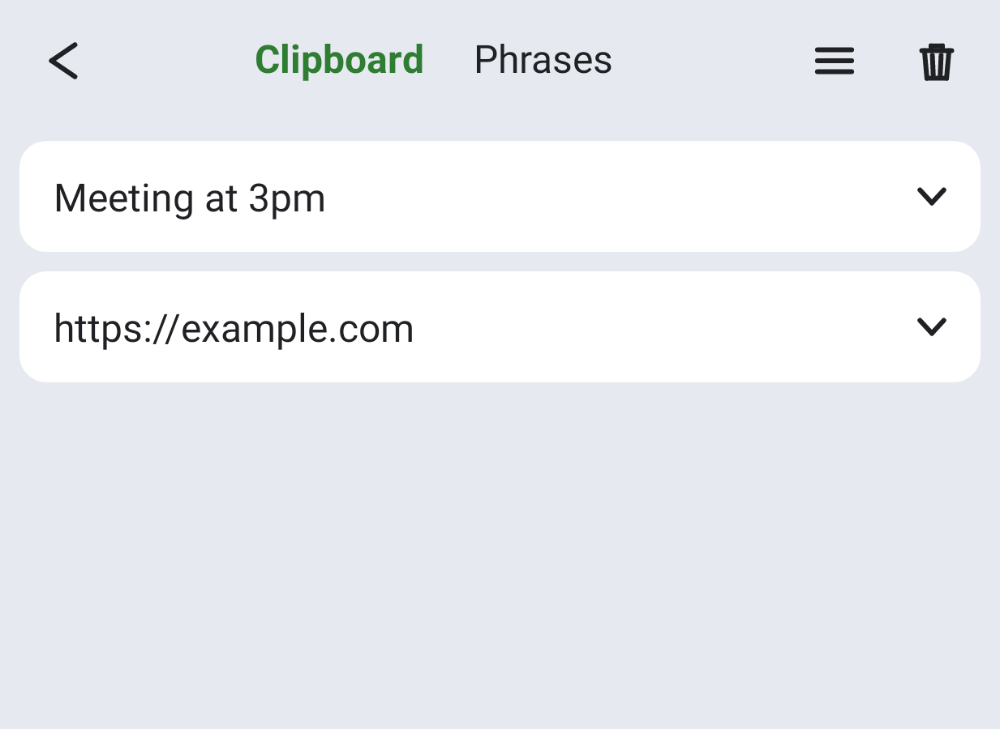
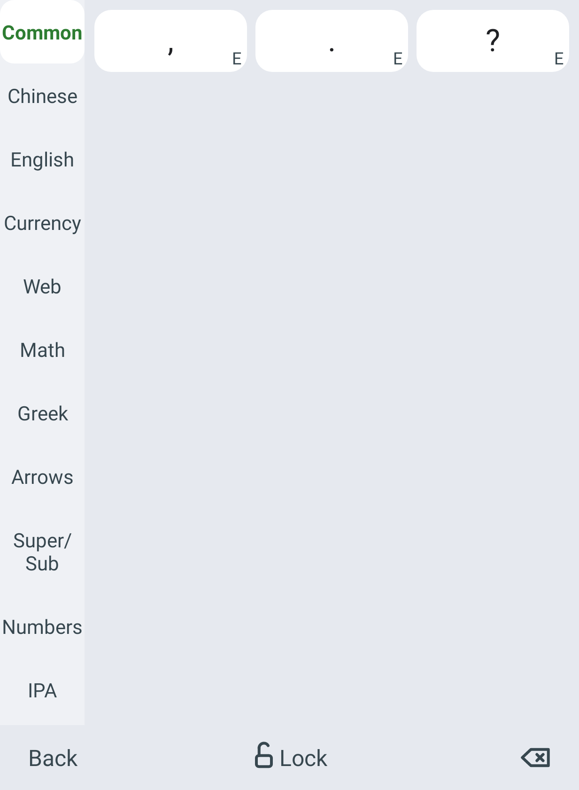
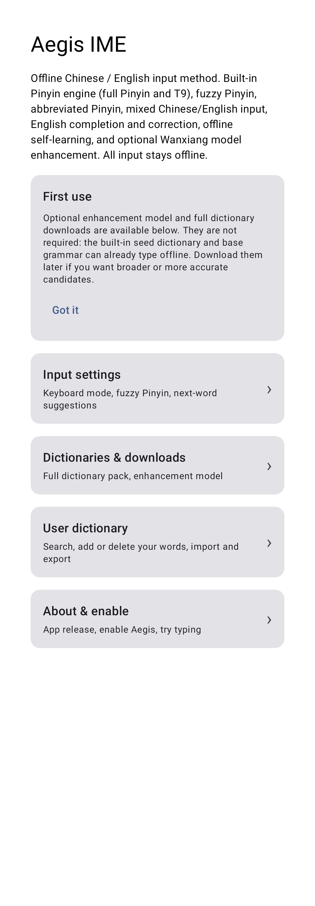

# Aegis IME

<p align="center">
  
</p>

[](LICENSE)
[](https://github.com/lurixo/Aegis/releases)
[-3DDC84.svg)](#requirements)

**Aegis** is an offline-first Android input method for **Simplified Chinese** and **English**.
It is built on the open **rime-wanxiang** CC BY dictionaries with a **self-built decoder** — no
rime / librime at runtime. Everything you type stays on your device: **there is no network use in
the typing path.**

**English** · [简体中文](README.zh-CN.md)

<p align="center">
  
  
</p>
<p align="center">
  
  
  
  
</p>

## Contents

- [For users — install &amp; enable](#for-users--install--enable)
- [Features](#features)
- [Privacy &amp; permissions](#privacy--permissions)
- [Build (for developers)](#build-for-developers)
- [Release dictionary pack](#release-dictionary-pack)
- [Architecture](#architecture)
- [Licensing &amp; acknowledgments](#licensing--acknowledgments)
- [Contributing](#contributing)
- [Status](#status)

## For users — install & enable

Aegis is not on an app store yet; it is distributed as a downloadable APK.

### Requirements

- **Android 14 or newer** (minSdk 34). Older Android versions are not supported.

### Install

1. Open the [**Releases**](https://github.com/lurixo/Aegis/releases) page and download the APK
   asset from the latest build (releases are currently marked **pre-release / debug**).
2. Because the app is installed outside an app store, Android will ask you to **allow installing
   unknown apps** for the browser or file manager you used — grant it when prompted, then open the
   downloaded APK to install (this is a **sideload**).

### Enable Aegis as a keyboard

Menu names vary slightly by device, but the flow is the standard Android one:

1. **Settings → System → Languages & input → On-screen keyboard** (on some phones: *Manage
   keyboards* / *Virtual keyboard*).
2. Turn **Aegis** on. Android shows a warning that a keyboard can read what you type — this is the
   standard notice for **every** input method; see [Privacy & permissions](#privacy--permissions)
   for exactly what Aegis does and does not do.
3. Switch to Aegis while typing: tap the **input-method / globe key** on the keyboard, or open the
   **"Choose input method"** notification / picker and select **Aegis**.

### First run

The bundled seed dictionary and base grammar can already type offline, so nothing else is required.
If you want broader coverage or more accurate candidates, the settings screen offers **optional**
downloads (full dictionary pack and enhancement model). Those are the *only* things that ever use
the network, and only when you tap to start them.

## Features

- **Two input modes** — **26-key full pinyin** and **9-key T9**, plus **number** and **symbol**
  layouts, on a self-drawn View+Canvas keyboard.
- **Lattice Viterbi decoder** over a memory-mapped dictionary, scored by unigram log-probability
  plus a **character-bigram** context model.
- **Fuzzy pinyin** for retroflex/flat sibilants and front/back nasals, with a user toggle.
- **Jianpin** (initials abbreviation) — `zg`→中国, `bjdx`→北京大学.
- **CN–EN mixed input** — commit English words (e.g. `wifi`) without switching language, with
  English completion and correction.
- **On-device learning** — frequently and recently used words rank up, next-word predictions are
  learned, and the user dictionary can be imported/exported. Stored only in `filesDir/userdb.txt`.
- **Emoji selector** — recents plus categorized emoji (faces, gestures, animals, flags, and more).
- **Clipboard history & saved phrases (常用语)** — recent clips and reusable phrases in one panel,
  with per-item management.
- **Symbol & edit panels** — a categorized symbol board (Chinese, English, currency, math, Greek,
  arrows, and more, with a lock toggle) and a cursor/text-editing panel.
- **Simplified-Chinese normalization** — every candidate Aegis proposes is Simplified. Traditional
  and variant character forms from the upstream data are folded to their Simplified image (with
  frequency merging) when the dictionary is built, using the bundled OpenCC tables.
- **Material 3** setup screen.

## Privacy & permissions

A keyboard sees everything you type, so trust is the whole point. Aegis is built so that trust does
not depend on our word alone:

- The app declares exactly **one** Android permission: **`INTERNET`**.
- That permission is used **only** when *you* tap to download the optional full dictionary pack or
  the optional enhancement model. **The typing path makes no network calls at all.**
- Your **keystrokes, candidates, learned words, user dictionary, and clipboard never leave the
  device** — they live in the app's private storage (`filesDir`).
- There is **no analytics, no telemetry, and no account.**

See [PRIVACY.md](PRIVACY.md) for the full statement.

## Build (for developers)

Prerequisites:

- **JDK 17**
- **Android SDK** with **platform 37** (`compileSdk` / `targetSdk` are 37; `minSdk` is 34)
- **Gradle** is provided by the wrapper — just use `./gradlew` (no system Gradle needed)

```
./gradlew assembleDebug           # build the debug APK
./gradlew :app:testDebugUnitTest  # JVM unit tests (decoder, dict, fuzzy, jianpin, learning, UI)
./gradlew :app:lintDebug          # Android lint
```

The bundled dictionaries (`app/src/main/assets/aegis_*.bin`, roughly 75 MB in total) are the
**seed** pack — prebuilt from all 14 wanxiang tables (`zi jichu lianxiang cuoyin duoyin shici diming
yixue huaxue yaopin mingren yiren wuzhong renming`) at `--min-freq 400` by the `:tools` module. The
seed build adds `--keep-syllable-singles 3`: a syllable whose single characters *all* fall below the
trim threshold keeps its top-3 single characters (by source frequency) anyway, so rare-but-valid
syllables (cen/chua/den/kei/m/nou/rua) stay typeable. The **full** pack (the same 14 tables at
`--min-freq 1`, no per-key cap) is built the same way and hosted as a downloadable asset; at runtime
a downloaded `aegis_*.bin` under `filesDir/downloaded/` overrides the seed.

```
./gradlew :tools:installDist
# seed pack (bundled): --min-freq 400 ; full pack (download): --min-freq 1
tools/build/install/tools/bin/tools --out <dict> --min-freq 400 --keytype letter   --keep-syllable-singles 3 --t2s-data tools/t2s-data <14 wanxiang .dict.yaml ...>
tools/build/install/tools/bin/tools --out <t9>   --min-freq 400 --keytype digit    --keep-syllable-singles 3 --t2s-data tools/t2s-data <14 ...>
tools/build/install/tools/bin/tools --out <jp>   --min-freq 400 --keytype initials --t2s-data tools/t2s-data <14 ...>
tools/build/install/tools/bin/tools lm --out <lm> <14 wanxiang .dict.yaml ...>
```

See [CONTRIBUTING.md](CONTRIBUTING.md) for branch/PR conventions, commit style, and the full
dictionary-build workflow.

## Release dictionary pack

Each app release publishes the APK and the current full dictionary pack in the same GitHub release.
The app discovers dictionary updates from `lurixo/Aegis` release assets, preferring the latest
pre-release dictionary ZIP by `published_at`, then falling back to normal releases. The
source/provenance link remains `https://github.com/amzxyz/rime-wanxiang`; the physical download is
the Aegis-converted binary ZIP release asset.

```
tools/release/build_dictionary_pack.py --release-tag vX.Y.Z-debug.N
```

The command clones `amzxyz/rime-wanxiang` (a stable tag by default, or use `--source-dir`), builds
the 14 verified tables with `tools/DictBuilder` at `--min-freq 1` and no per-key cap, and writes the
pack ZIP, `aegis-build-info.json`, and `aegis-dictionary-update.json` under `build/release-dictionary/`.
Upload those generated files to the same GitHub release as the APK. The checked-in
`aegis-build-info.json` records the current release's pack trail (source tag & commit, per-table
input hashes, build parameters, and output-bin hashes) and its remaining provenance gaps; each
release regenerates it for the freshly built asset. A dictionary pack is not a fully reproducible
public supply-chain artifact until the release also carries the exact input hashes, a deterministic
recipe, and a signature or attestation.

## Architecture

- `app/.../ime` — IME service, self-drawn keyboard/candidate views, panels (emoji, clipboard,
  symbols, edit), input state machine.
- `app/.../decoder` — `PinyinDecoder` (word-lattice Viterbi; exact > fuzzy > jianpin edges).
- `app/.../dict` — mmap readers: `BinaryDict`, `CharBigramLM`, `Fuzzy`.
- `app/.../user` — `UserModel` (offline learning, file-persisted).
- `tools/` — host dict/LM builders (`DictBuilder`, `LmBuilder`) + eval verifier + release packager.

## Licensing & acknowledgments

Aegis's own code is **GPL-3.0** (see [`LICENSE`](LICENSE)). Aegis ships a **self-built decoder**
(clean-room Kotlin) and is an **independent project, not affiliated with the RIME project** — it
links no librime / native code. It stands on open data from the **wanxiang** project by **amzxyz**,
with our deepest thanks. The third-party attribution / ShareAlike obligations below are not waived
by Aegis's own license.

**rime-wanxiang dictionaries** — © amzxyz and rime-wanxiang contributors, **CC BY 4.0**
(https://github.com/amzxyz/rime-wanxiang). The bundled `assets/aegis_{dict,t9,jianpin}.bin` and
`aegis_lm.bin` are derivatives of the full 14 tables (字 基础 联想 错音 多音 诗词 地名 医学 化学
药品 名人 异体 物种 人名). **Changes:** tones stripped (ü→v), syllables concatenated into toneless
keys, traditional/variant forms folded to Simplified (OpenCC tables), repacked into Aegis's binary
format; the bundled seed is frequency-filtered (`--min-freq 400`) for size, the downloadable full
pack keeps every entry (`--min-freq 1`).

**wanxiang octagram model** (`wanxiang-lts-zh-hans.gram`) — © amzxyz, **CC BY 4.0**
(https://github.com/amzxyz/RIME-LMDG). The optional top-tier context model behind next-word /
whole-sentence ranking; fetched only on explicit opt-in, **not** bundled in the APK.
`OctagramReader` (Kotlin, GPL-3.0) is original Aegis code; its on-disk format was clean-room
reverse-engineered from **librime-octagram** (GPL-3.0) + **darts-clone** — no upstream source copied.

**OpenCC data** (`tools/t2s-data`) — traditional→simplified and variant mappings, **Apache-2.0**
(see `tools/t2s-data/LICENSE-OpenCC` and `tools/t2s-data/PROVENANCE.md`); used at dictionary-build
time only.

**Other:** AndroidX / Jetpack Compose / Material 3 / Kotlin stdlib — Apache-2.0; JUnit — EPL (test
scope only, not distributed). Algorithm references (not vendored): AOSP PinyinIME (Apache-2.0),
darts-clone (BSD-2-Clause).

## Contributing

Contributions are welcome. Please read [CONTRIBUTING.md](CONTRIBUTING.md) (build/test commands,
branch & PR conventions, commit style) and the [Code of Conduct](CODE_OF_CONDUCT.md). Security
reports have a private channel — see [SECURITY.md](SECURITY.md).

## Status

Aegis is in active development and releases are currently **pre-release / debug** builds. Known
limitations:

- Releases are unsigned debug/prerelease APKs distributed via GitHub Releases, not an app store.
- The downloadable dictionary pack records its build inputs but is not yet a signed / independently
  reproducible supply-chain artifact (see [Release dictionary pack](#release-dictionary-pack)).
