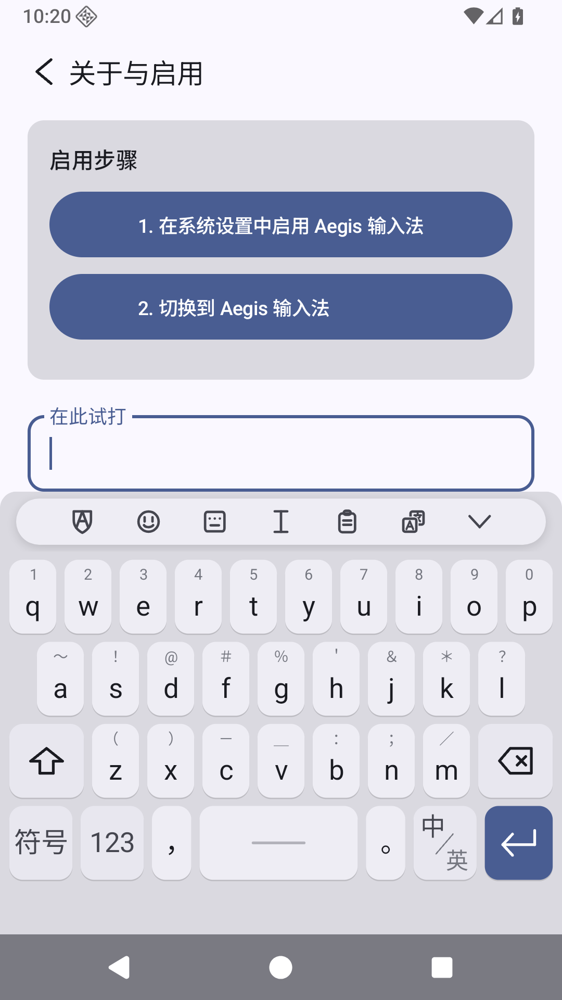
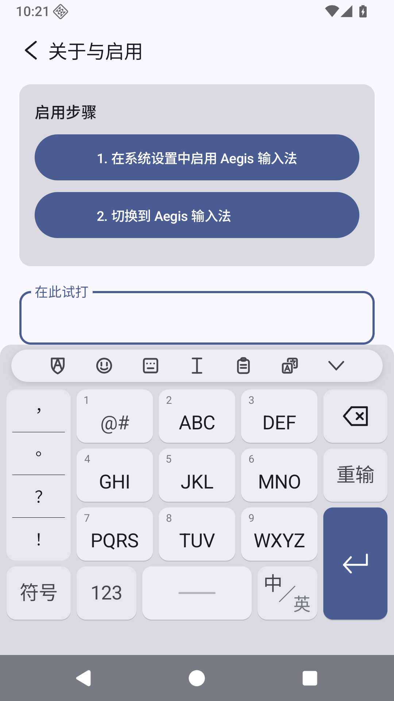
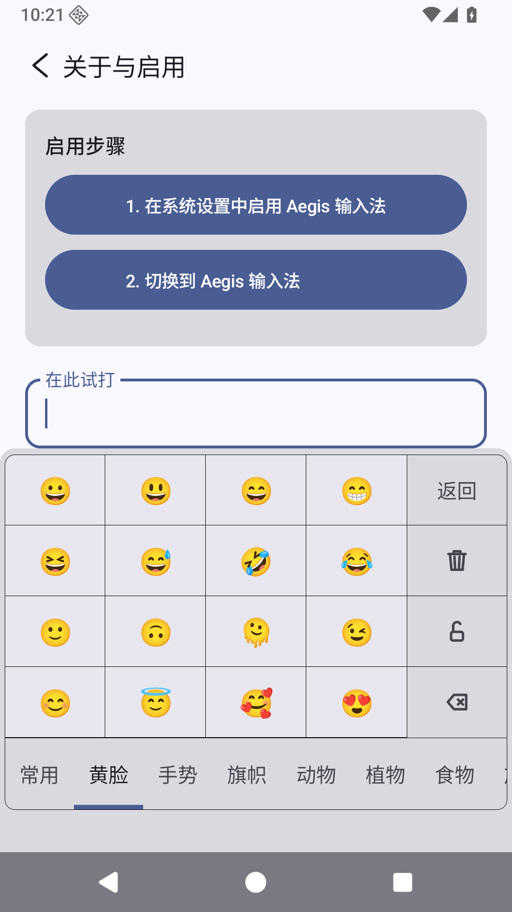
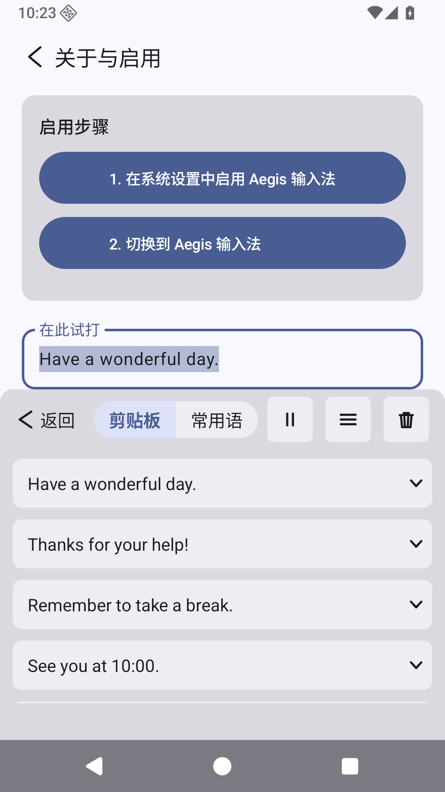
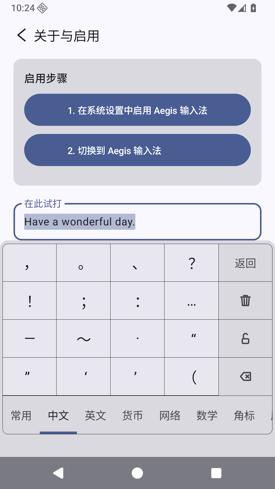

# Aegis 输入法

<p align="center">
  
</p>

[](LICENSE)
[](https://github.com/lurixo/Aegis/releases)
[-3DDC84.svg)](#系统要求)

**Aegis** 是一款离线优先的安卓**简体中文与英文**输入法。它基于开源的 **rime-wanxiang**（万象）
CC BY 词库，配以**自研解码器**——运行时不依赖 rime 或 librime。**翻译栏之外，输入时绝不会发起网络请求，你输入的内容也绝不会被发送**；翻译栏只发送你输入到栏里的文字。

[English](README.md) · **简体中文**

<div align="center">
<table>
<tr>
<td></td>
<td></td>
</tr>
</table>
<table>
<tr>
<td></td>
<td></td>
<td></td>
</tr>
</table>
</div>

## 目录

- [面向用户——安装与启用](#面向用户安装与启用)
- [功能](#功能)
- [隐私与权限](#隐私与权限)
- [构建（面向开发者）](#构建面向开发者)
- [发布词库包](#发布词库包)
- [架构](#架构)
- [许可与致谢](#许可与致谢)

## 面向用户——安装与启用

Aegis 暂未上架应用商店，目前以可下载的 APK 形式分发。

### 系统要求

- **Android 14 及以上**（minSdk 34）。不支持更低版本的安卓。
- **64 位 ARM** 设备（`arm64-v8a`）；发布的 APK 只携带这一个 ABI。

### 安装

1. 打开 [**Releases**](https://github.com/lurixo/Aegis/releases) 页面，从最新构建里下载 APK
   附件。发布标注为**预发布**，APK 是 release 构建，以安卓调试密钥签名。
2. 由于并非从应用商店安装，安卓会提示你为所用的浏览器或文件管理器**允许安装未知应用**——按提示授予后，打开下载的 APK 完成安装（即**侧载**）。

### 把 Aegis 启用为键盘

各家设备的菜单名称略有差异，流程是标准的安卓流程：

1. **设置 → 系统 → 语言和输入法 → 屏幕键盘**（部分手机为*管理键盘*或*虚拟键盘*）。
2. 打开 **Aegis** 开关。安卓会提示键盘可以读取你输入的内容——这是**每一款**输入法都会出现的标准提示；Aegis 到底做与不做什么，见[隐私与权限](#隐私与权限)。
3. 打字时切换到 Aegis：点按键盘上的**输入法键或地球键**，或打开**“选择输入法”**通知或选择器，选择 **Aegis**。

### 首次使用

**英文可以立即输入，中文需要先下载一次。**APK 内不含中文词库，键盘也绝不会自行开始下载词库包。在没有词库包时输入中文，候选栏会给出下载入口——下载约 103 MB，安装到应用私有存储后约 275 MB，且不限于 Wi-Fi——只有你点按该入口（或设置页词库卡片中的“下载”）才会开始传输。传输中断后可以续传，安装前还会核对 SHA-256。在它完成之前，中文输入处于锁定状态，而英文与各面板照常可用。

设置页另外提供**可选**的增强模型（约 420 MB 的八元语法模型），用于更准的下一词与整句排序；这一项仅在你点击开始时才下载。文件装好后，对应卡片会提供检测更新的按钮，检查到更新的文件会直接接着下载。除这两项下载、随之进行的更新检测（词库是一个小的元数据文件，模型是一个 `HEAD` 请求），以及翻译栏（打开时只把你输入到翻译栏里的文字发送给 Google 翻译）之外，Aegis
自身的代码不发起任何网络请求；不经你的操作，Aegis 自身不会有任何联网。

## 功能

- **键盘形态** —— **26 键全拼**、**9 键 T9** 与**英文 26 键**，外加**数字**、**符号**与
  **数字小键盘**布局，基于自绘的 View+Canvas 键盘。打开联想开关后，在英文键盘上打字还会由词库包中的英文表给出单词补全。横屏时键盘保持竖屏宽度并靠一侧停靠，让背后的应用仍可触及。
- **格状 Viterbi 解码器** —— 在内存映射词库上解码，以一元对数概率加**字级二元**上下文模型打分；装上增强模型后，再叠一层下一词与整句重排。
- **模糊拼音** —— 共十条规则：`zh/z`、`ch/c`、`sh/s`、`ang/an`、`eng/en`、`ing/in`、`n/l`、
  `f/h`、`l/r`、`k/g`。总开关默认关闭，打开后每条规则还各有一个独立开关；改动即时生效。
- **简拼**（声母缩写）—— `zg`→中国，`bjdx`→北京大学。
- **音节控制** —— 九键键盘的侧栏列出当前输入对应的读音，点选即锁定；再点一次已锁定的读音，会给出与它同音的字。编码未上屏时，另有分词键让你自己决定在哪里断开字母串。
- **展开候选** —— 候选栏末端的箭头把它展开为整页面板；“重输”键下方的“全部/单字”键把列表收窄到单字。
- **中英混输** —— 无需切换语言即可上屏英文单词（如 `wifi`）。
- **本机学习** —— 常用、近用词自动提权，并学习下一词搭配。自动学习有独立开关；候选栏的下一词预测另有一个开关，默认关闭，可自行打开。自动学到的词长期不用会淡出，你自己添加的词永不遗忘。在任何声明不参与个性化学习的输入框里，不学习任何词；在这些输入框里，符号与 emoji 面板也不会记录你选了什么。数据都存在应用私有的
  `filesDir` 下（`userdb.txt` 与 `userlearn.txt`），用户词库界面可搜索、添加、删除、导入、导出与清空。
- **Emoji 面板** —— “常用”页加各分类（黄脸、手势、旗帜、动物、植物、食物、旅行、活动、物品、符号），支持肤色与性别变体，并有锁定开关便于连续选取。
- **剪贴板历史** —— 复制过的内容留下来随时取用，可逐条删除、批量删除、全选与整体清空；历史记录本身也可以整个关掉。
- **常用语** —— 剪贴板面板的“常用语”页保存可复用的短语，支持自定义分类、分类排序、跨类移动、逐条备注，并可导入导出为纯文本文件。
- **翻译栏** —— 工具栏的翻译键在候选栏上方打开一行翻译栏，输入到栏里的文字发送给 Google 翻译，译文实时进入正在编辑的输入框并随你的修改更新；支持自动识别、中英互译与中日互译，直到你关闭翻译栏或再点一次翻译键为止。
- **符号与编辑面板** —— 符号板带“常用”页，另有中文、英文、货币、网络、数学、希腊、箭头、角标、序号、音标、拼音各分类，并有锁定开关；文本编辑面板提供光标移动、行首行尾、开始/结束选择、全选、复制、剪切、粘贴与删除。这里的复制与剪切进入 Aegis 剪贴板而不是系统剪贴板，因此需要开着剪贴板历史，否则会被拒绝并提示；特别长的选区会分段有界读取，未能全部取到时会提示只复制了多少个字。粘贴插入 Aegis 剪贴板最新的一条。
- **自定义符号** —— 自选九键侧栏的标点，以及数字小键盘上的运算符。
- **符号与 emoji 联想** —— 输入拼音时，候选栏可直接给出匹配的符号与 emoji。
- **算式计算** —— 输入算式后候选栏给出结果，支持 `+ - * / × ÷`、括号、正负号与 `%`。
- **复制条** —— 刚复制或剪切的文本会出现在键盘上方，可整条上屏，也可拆成词块后挑选上屏。
- **加密备份** —— 把用户词库、自动学习、常用语、剪贴板历史、符号历史、表情历史和全部设置导出为单个加密文件（AES-256-GCM，密钥由 PBKDF2-HMAC-SHA256 迭代 600,000 次导出），导入时可选覆盖或合并。默认备份密码可保存在本机，保存与回填都需要生物识别或锁屏验证。可下载的词库与模型不进备份——它们可以重新下载。
- **简体归一** —— Aegis 给出的每一个候选都是简体。上游数据中的繁体与异体字形，在构建词库包时被归并到其简体形态（并合并词频），使用 `tools/t2s-data` 下的 OpenCC 映射表。该过程只在构建主机上进行，APK 内不含任何转换表。
- **Material 3** 设置界面 —— 输入设置、词库与下载、用户词库、数据备份、关于与启用，以及开源许可页。

## 隐私与权限

键盘能看到你输入的一切，所以信任是关键。Aegis 的设计让这份信任不必只靠我们的口头承诺：

- 应用自身的清单声明**两项**安卓权限：**`INTERNET`** 与 **`USE_BIOMETRIC`**。实际安装的 APK 里还列有第三项 `com.aegis.ime.DYNAMIC_RECEIVER_NOT_EXPORTED_PERMISSION`，由 AndroidX 库在清单合并时加入；它不是安卓平台权限，声明在 Aegis 自己的命名空间下、保护级别为 `signature`，不索取你设备上的任何东西。
- **`INTERNET`** 用于获取词库包（因为 APK 内不含中文词库；在没有词库包时键盘会给出下载入口，仅在你点按时才开始下载）、可选的增强模型（仅在*你*点击开始时才下载），这两者的更新检测，以及翻译栏（只把输入到翻译栏里的文字经 HTTPS 发送给 Google 翻译，即 `translate-pa.googleapis.com`）。
  **翻译栏之外，输入时绝不会发起网络请求，你输入的内容也绝不会被发送。**
- **`USE_BIOMETRIC`** 仅用于默认备份密码：保存它、或把它填入备份对话框，都需要先通过生物识别或锁屏验证。
- 你的**输入、候选、已学词、用户词库与剪贴板都不会离开设备**——它们存放在应用私有存储（`filesDir`）。会离开的只有两样：**你自己导出**的文件（备份、用户词库或常用语，去向由你选定），以及你输入到翻译栏里的文字（只发给 Google 翻译）。
- Aegis 被排除在安卓的**云备份与换机传输**之外，数据也不会由这条路被带离设备。
- **无任何分析、无遥测、无账号。**
- APK 里有一部分不是 Aegis 自己的代码：`androidx.emoji2` 随 Jetpack Compose 一同引入。在 Aegis
  自己的界面被打开之后，它会在设备上查找系统镜像中提供 emoji 字体的程序包并向其索取字体；设备上没有这样的程序包时，则不会向任何一方索取。这在应用的每次运行中最多发生一次，打字不会触发它。
  Aegis 不为此建立任何连接，也不随之发送你的任何数据。

完整声明见 [PRIVACY.md](PRIVACY.md)。

## 构建（面向开发者）

先决条件：

- **JDK 25** —— CI 使用的工具链；Java 与 Kotlin 的字节码目标为 17
- **Android SDK**，含 **platform 37** 与 **build-tools 36**（`compileSdk` 与 `targetSdk` 为 37；
  `minSdk` 为 34）
- **Gradle** 由 wrapper 提供——直接用 `./gradlew` 即可（无需系统级 Gradle）

```
./gradlew assembleDebug           # 构建 debug APK
./gradlew :app:testDebugUnitTest  # JVM 单元测试（解码器、词库、模糊、简拼、学习、UI）
./gradlew :app:lintDebug          # Android lint
```

APK 内不打包任何由词库派生的资源：`app/build.gradle.kts` 把 `aegis_dict.bin`、`aegis_t9.bin`、
`aegis_jianpin.bin`、字级二元上下文模型 `aegis_lm.bin` 以及英文表 `aegis_english.bin` 一并排除在打包资源之外。这五者作为同一个词库包的成员，在运行时下载到 `filesDir/downloaded/`；三个中文词库是中文候选的唯一来源，`aegis_lm.bin`
负责重排，英文表（包内为 `aegis_en_full.bin`）提供英文单词补全。解码并不强依赖 `aegis_lm.bin`，但缺它的包会被判为不完整，应用会再次给出下载入口；英文表是可选成员。

APK 内确有一份 Aegis 自建的生成表 `aegis_tgh.bin`：派生自国家规范《通用规范汉字表》（8105 字，分
一 / 二 / 三级）的汉字分级表，用于判定哪些单字候选算作生僻。它以 Java 资源形式打进包内路径
`com/aegis/ime/dict/aegis_tgh.bin`，不是 Android `assets/` 条目，因此单元测试从 classpath 读到的与
应用运行时读到的是同一份字节。它由构建过程从签入的源表
`app/src/main/assets-src/tongyong-guifan-hanzi-8105.tsv` 生成，生成的二进制文件不入库。表内只有码位
与级别，不派生自任何词库，也不随词库包更新而变化。打包的 `assets/` 不会因此多出任何条目，里面仍然
只有 Android Gradle 插件为 release 构建加入的 `dexopt` 基线配置文件。

需要真实词表的解码测试从 `AEGIS_FULLDICT_DIR` 指向的目录读取；`python3 tools/fetch_test_dict.py`
会下载已发布的词库包并解到 `app/src/main/assets/`，这些文件既不进 APK 也不进 git。

词库包由 `:tools` 模块从全部 14 张万象表（`zi jichu lianxiang cuoyin duoyin shici diming yixue
huaxue yaopin mingren yiren wuzhong renming`）以 `--min-freq 1`、无每键上限预构建，保留每一条。

```
./gradlew :tools:installDist
tools/build/install/tools/bin/tools --out <dict> --min-freq 1 --keytype letter   --t2s-data tools/t2s-data <14 张万象 .dict.yaml ...>
tools/build/install/tools/bin/tools --out <t9>   --min-freq 1 --keytype digit    --t2s-data tools/t2s-data <14 ...>
tools/build/install/tools/bin/tools --out <jp>   --min-freq 1 --keytype initials --t2s-data tools/t2s-data <14 ...>
tools/build/install/tools/bin/tools lm --out <lm> --t2s-data tools/t2s-data <14 张万象 .dict.yaml ...>
```

本文的截图实拍自运行中的应用，`docs/screenshots/` 保存上文引用的那份副本。

## 发布词库包

应用 APK 发布与可下载词库包分开发布。带版本号的应用 release 只携带 APK。词库包发布在滚动的
[`dict-latest`](https://github.com/lurixo/Aegis/releases/tag/dict-latest) GitHub release 上；应用只从这个 release tag 发现词库更新，判据是已安装包与当前词库 ZIP 的 SHA-256 比对，或者本机包缺少某个成员文件。

```
tools/release/build_dictionary_pack.py --release-tag dict-latest
```

该命令克隆 `amzxyz/rime-wanxiang`（默认取 `wanxiang` 分支，用 `--source-tag` 改为固定到某个
release tag，或用 `--source-dir` 指定已有的本地目录），用 `tools/DictBuilder` 以 `--min-freq 1`、无每键上限构建 14 张已核验表。它在
`build/release-dictionary/` 下写出**中间态**词库包 ZIP、`aegis-build-info.json` 与
`aegis-dictionary-update.json`。该中间包包含三个中文词库与字级语言模型共四个运行时组件，**绝对不得直接发布**。

独立受控的词库工作流先在中间态上应用读音门禁与固定的 GB 18030 拼音可达性
overlay，核验结果后执行本构建器的 `finalize`。随后，工作流从同一个固定上游 commit
构建英文表并附加 `aegis_en_full.bin`。只有这份最终五运行时组件 ZIP，以及与它匹配的最终
build-info 和更新 manifest，才能成为 `dict-latest` 的发布候选；上述命令的原始产物不能上传。五个运行时组件为
`aegis_dict_full.bin`、`aegis_t9_full.bin`、`aegis_jianpin_full.bin`、`aegis_lm.bin` 和
`aegis_en_full.bin`。

已签入的 `aegis-build-info.json` 记录产物的溯源链（来源 tag 与 commit、逐表输入哈希、构建参数、组件哈希和物理附件 URL）及其尚存的溯源缺口；每次重新发布滚动词库包时，必须从最终五组件候选重新生成它。在 release 同时携带确切输入哈希、可确定复现的配方以及签名或证明之前，词库包还不是完全可复现的公共供应链产物。

## 架构

- `app/.../ime` —— 输入法服务、自绘键盘与候选视图、各面板（emoji、剪贴板、符号、自定义符号、编辑）、复制条、翻译栏、输入状态机。
- `app/.../decoder` —— `PinyinDecoder`（词格 Viterbi；精确 > 模糊 > 简拼边）。
- `app/.../dict` —— 内存映射读取器 `BinaryDict`、`CharBigramLM`、`Fuzzy`、`OctagramReader`，以及
  `ModelDownload`——下载与更新检测，全应用两处发起网络请求的地方之一。
- `app/.../translate` —— `TranslateClient`（翻译栏发往 Google 翻译的请求，另一处发起网络请求的地方）与 `TranslateDirection`（决定目标语言）。
- `app/.../engine` —— 候选装配、符号与 emoji 联想、算式计算。
- `app/.../layout` —— 按键与布局定义、符号与 emoji 目录。
- `app/.../user` —— 本机数据：`UserModel` 与 `UserLearning`、剪贴板与常用语存储、自定义符号、符号使用记录。
- `app/.../backup` —— 加密备份归档、加解密与恢复。
- `app/.../ui` —— Compose 设置界面、词库与模型卡片、用户词库、备份、关于、开源许可。
- `tools/` —— 主机侧词库与语言模型构建器（`DictBuilder`、`LmBuilder`）、评测校验器与发布打包器。

## 许可与致谢

Aegis 自身代码为 **GPL-3.0**（见 [`LICENSE`](LICENSE)）。Aegis 采用**自研解码器**（净室 Kotlin），是一个**独立项目，与 RIME 项目无从属关系**——不链接任何 librime 或原生代码。它立足于 **amzxyz** 的
**万象（wanxiang）** 项目所提供的开放数据，在此致以最深的谢意。下述第三方署名与相同方式共享义务不因 Aegis 自身许可而被免除。

**rime-wanxiang 词库** —— © amzxyz 及 rime-wanxiang 贡献者，**CC BY 4.0**，见
[rime-wanxiang](https://github.com/amzxyz/rime-wanxiang)。可下载的 `aegis_{dict,t9,jianpin}.bin`
与 `aegis_lm.bin` 是全部 14 张表（字 基础 联想 错音 多音 诗词 地名 医学 化学 药品 名人 异体 物种 人名）的衍生物。**改动：**去声调（ü→v），音节拼接为无调键，繁体与异体归并到简体（OpenCC 表），重新打包为 Aegis 的二进制格式；词库包保留每一条（`--min-freq 1`）。

**万象八元语法模型**（`wanxiang-lts-zh-hans.gram`）—— © amzxyz，**CC BY 4.0**，见
[RIME-LMDG](https://github.com/amzxyz/RIME-LMDG)。用于下一词和整句排序的可选顶层上下文模型；仅在明确选择时才下载，**不**打包进 APK。`OctagramReader`（Kotlin，GPL-3.0）是 Aegis 原创代码；其磁盘格式由 **librime-octagram**（GPL-3.0）与 **darts-clone** 净室逆向而得——未复制任何上游源码。

**OpenCC 数据**（`tools/t2s-data`）—— 繁转简与异体映射，**Apache-2.0**（见
`tools/t2s-data/LICENSE-OpenCC` 与 `tools/t2s-data/PROVENANCE.md`）；仅在构建词库时使用。

**其他：**AndroidX、Jetpack Compose、Material 3、Kotlin 标准库 —— Apache-2.0；JUnit —— EPL
（仅测试范围，不随包分发）。算法参考（未内联引入）：AOSP PinyinIME（Apache-2.0）、
darts-clone（BSD-2-Clause）。

完整清单及各自的改动记录见 [`THIRD_PARTY_LICENSES.md`](THIRD_PARTY_LICENSES.md)；应用内
**设置 → 关于与启用 → 开源许可** 展示同一份清单。
