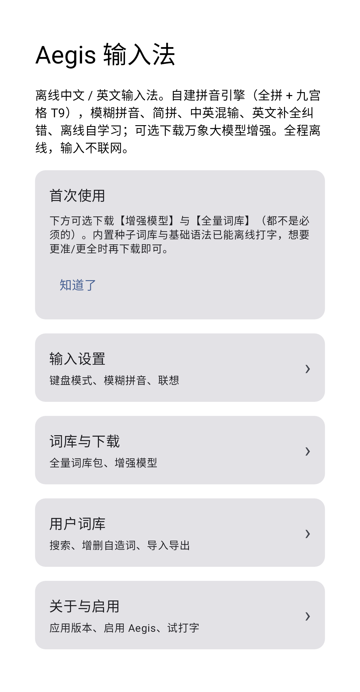

# Aegis 输入法

<p align="center">
  
</p>

[](LICENSE)
[](https://github.com/lurixo/Aegis/releases)
[-3DDC84.svg)](#系统要求)

**Aegis** 是一款离线优先的安卓**简体中文 / 英文**输入法。它基于开源的 **rime-wanxiang**（万象）
CC BY 词库，配以**自研解码器**——运行时不依赖 rime / librime。你输入的一切都留在本机：**打字路径
完全不联网。**

[English](README.md) · **简体中文**

<p align="center">
  
  
</p>
<p align="center">
  
  
  
</p>
<p align="center">
  
</p>

## 目录

- [面向用户 —— 安装与启用](#面向用户--安装与启用)
- [功能](#功能)
- [隐私与权限](#隐私与权限)
- [构建（面向开发者）](#构建面向开发者)
- [发布词库包](#发布词库包)
- [架构](#架构)
- [许可与致谢](#许可与致谢)
- [参与贡献](#参与贡献)
- [状态](#状态)

## 面向用户 —— 安装与启用

Aegis 暂未上架应用商店，目前以可下载的 APK 形式分发。

### 系统要求

- **Android 14 及以上**（minSdk 34）。不支持更低版本的安卓。

### 安装

1. 打开 [**Releases**](https://github.com/lurixo/Aegis/releases) 页面，从最新构建里下载 APK
   附件（当前发布均标注为 **预发布 / debug**）。
2. 由于并非从应用商店安装，安卓会提示你为所用的浏览器或文件管理器**允许安装未知应用**——按提示
   授予后，打开下载的 APK 完成安装（即**侧载**）。

### 把 Aegis 启用为键盘

各家设备的菜单名称略有差异，流程是标准的安卓流程：

1. **设置 → 系统 → 语言和输入法 → 屏幕键盘**（部分手机为 *管理键盘* / *虚拟键盘*）。
2. 打开 **Aegis** 开关。安卓会提示键盘可以读取你输入的内容——这是**每一款**输入法都会出现的
   标准提示；Aegis 到底做与不做什么，见[隐私与权限](#隐私与权限)。
3. 打字时切换到 Aegis:点键盘上的**输入法 / 地球键**,或打开**"选择输入法"**通知 / 选择器,
   选 **Aegis**。

### 首次使用

内置的种子词库与基础语法已经可以离线打字,无需其他步骤。若想要更广的覆盖或更准的候选,设置页
提供**可选**下载(完整词库包与增强模型)。这些是唯一会用到网络的内容,且仅在你点击开始时才发起。

## 功能

- **两种输入模式** —— **26 键全拼**与 **9 键 T9**,外加**数字**、**符号**布局,基于自绘的
  View+Canvas 键盘。
- **格状 Viterbi 解码器** —— 在内存映射词库上解码,以一元对数概率加**字级二元**上下文模型打分。
- **模糊拼音** —— 覆盖平翘舌与前后鼻音,带用户开关。
- **简拼**(声母缩写) —— `zg`→中国,`bjdx`→北京大学。
- **中英混输** —— 无需切换语言即可上屏英文单词(如 `wifi`),含英文补全与纠错。
- **本机学习** —— 常用、近用词自动提权,学习下一词预测,用户词库可导入 / 导出。仅存于
  `filesDir/userdb.txt`。
- **Emoji 选择器** —— 最近使用加分类 emoji(黄脸、手势、动物、旗帜等)。
- **剪贴板历史与常用语** —— 近期剪贴与可复用常用语同在一个面板,支持逐条管理。
- **符号与编辑面板** —— 分类符号板(中文、英文、货币、数学、希腊、箭头等,带锁定开关)以及
  光标 / 文本编辑面板。
- **简体归一** —— Aegis 给出的每一个候选都是简体。上游数据中的繁体与异体字形,在构建词库时被
  归并到其简体形态(并合并词频),使用内置的 OpenCC 映射表。
- **Material 3** 设置界面。

## 隐私与权限

键盘能看到你输入的一切,所以信任是关键。Aegis 的设计让这份信任不必只靠我们的口头承诺:

- 应用仅声明**一项**安卓权限:**`INTERNET`**。
- 该权限**仅**在*你*点击下载可选的完整词库包或可选增强模型时使用。**打字路径不发起任何网络请求。**
- 你的**击键、候选、已学词、用户词库与剪贴板都不会离开设备**——它们存放在应用私有存储
  (`filesDir`)。
- **无任何分析、无遥测、无账号。**

完整声明见 [PRIVACY.md](PRIVACY.md)。

## 构建（面向开发者）

先决条件:

- **JDK 17**
- **Android SDK**,含 **platform 37**(`compileSdk` / `targetSdk` 为 37;`minSdk` 为 34)
- **Gradle** 由 wrapper 提供——直接用 `./gradlew` 即可(无需系统级 Gradle)

```
./gradlew assembleDebug           # 构建 debug APK
./gradlew :app:testDebugUnitTest  # JVM 单元测试(解码器、词库、模糊、简拼、学习、UI)
./gradlew :app:lintDebug          # Android lint
```

内置词库(`app/src/main/assets/aegis_*.bin`,合计约 75 MB)是**种子**包——由 `:tools` 模块从全部
14 张万象表(`zi jichu lianxiang cuoyin duoyin shici diming yixue huaxue yaopin mingren yiren
wuzhong renming`)以 `--min-freq 400` 预构建。种子构建额外加 `--keep-syllable-singles 3`:若某音节
的单字**全部**低于裁剪阈值,则仍保留其(按来源词频)前 3 个单字,让稀有但有效的音节
(cen/chua/den/kei/m/nou/rua)可打。**完整**包(同样 14 表,`--min-freq 1`,无每键上限)以相同方式
构建并作为可下载附件托管;运行时,`filesDir/downloaded/` 下已下载的 `aegis_*.bin` 会覆盖种子包。

```
./gradlew :tools:installDist
# 种子包(内置): --min-freq 400 ; 完整包(下载): --min-freq 1
tools/build/install/tools/bin/tools --out <dict> --min-freq 400 --keytype letter   --keep-syllable-singles 3 --t2s-data tools/t2s-data <14 张万象 .dict.yaml ...>
tools/build/install/tools/bin/tools --out <t9>   --min-freq 400 --keytype digit    --keep-syllable-singles 3 --t2s-data tools/t2s-data <14 ...>
tools/build/install/tools/bin/tools --out <jp>   --min-freq 400 --keytype initials --t2s-data tools/t2s-data <14 ...>
tools/build/install/tools/bin/tools lm --out <lm> <14 张万象 .dict.yaml ...>
```

分支 / PR 约定、提交风格及完整的词库构建流程,见 [CONTRIBUTING.md](CONTRIBUTING.md)。

## 发布词库包

应用 APK 发布与可下载词库包分开发布。带版本号的应用 release 只携带 APK。完整词库包发布在滚动的
[`dict-latest`](https://github.com/lurixo/Aegis/releases/tag/dict-latest) GitHub release 上;应用只从
这个 release tag 发现词库更新,通过比较已安装词库包的 SHA-256 与当前词库 ZIP 附件来判断是否更新。

```
tools/release/build_dictionary_pack.py --release-tag dict-latest
```

该命令默认克隆 `amzxyz/rime-wanxiang`(默认取某个稳定 tag,或用 `--source-dir` 指定本地目录),
用 `tools/DictBuilder` 以 `--min-freq 1`、无每键上限构建 14 张已核验表,并在
`build/release-dictionary/` 下写出词库包 ZIP、`aegis-build-info.json` 与
`aegis-dictionary-update.json`。把这些生成文件上传到滚动的 `dict-latest` release,不要上传到带
版本号的应用 release。已签入的 `aegis-build-info.json` 记录当前滚动词库包溯源链(来源 tag 与
commit、逐表输入哈希、构建参数、输出 bin 哈希和物理附件 URL)及其尚存的溯源缺口;滚动词库包重新
发布时需要同步更新它。在 release 同时携带确切
输入哈希、可确定复现的配方以及签名 / 证明之前,词库包还不是完全可复现的公共供应链产物。

## 架构

- `app/.../ime` —— 输入法服务、自绘键盘 / 候选视图、各面板(emoji、剪贴板、符号、编辑)、
  输入状态机。
- `app/.../decoder` —— `PinyinDecoder`(词格 Viterbi;精确 > 模糊 > 简拼 边)。
- `app/.../dict` —— 内存映射读取器:`BinaryDict`、`CharBigramLM`、`Fuzzy`。
- `app/.../user` —— `UserModel`(离线学习,文件持久化)。
- `tools/` —— 主机侧词库 / 语言模型构建器(`DictBuilder`、`LmBuilder`)、评测校验器与发布打包器。

## 许可与致谢

Aegis 自身代码为 **GPL-3.0**(见 [`LICENSE`](LICENSE))。Aegis 采用**自研解码器**(净室 Kotlin),
是一个**独立项目,与 RIME 项目无从属关系**——不链接任何 librime / 原生代码。它立足于 **amzxyz** 的
**万象(wanxiang)**项目所提供的开放数据,在此致以最深的谢意。下述第三方署名 / 相同方式共享义务
不因 Aegis 自身许可而被免除。

**rime-wanxiang 词库** —— © amzxyz 及 rime-wanxiang 贡献者,**CC BY 4.0**
(https://github.com/amzxyz/rime-wanxiang)。内置的 `assets/aegis_{dict,t9,jianpin}.bin` 与
`aegis_lm.bin` 是全部 14 张表(字 基础 联想 错音 多音 诗词 地名 医学 化学 药品 名人 异体 物种
人名)的衍生物。**改动:**去声调(ü→v),音节拼接为无调键,繁体 / 异体归并到简体(OpenCC 表),
重新打包为 Aegis 的二进制格式;内置种子为控制体积做了词频过滤(`--min-freq 400`),可下载的完整包
保留每一条(`--min-freq 1`)。

**万象八元语法模型**(`wanxiang-lts-zh-hans.gram`) —— © amzxyz,**CC BY 4.0**
(https://github.com/amzxyz/RIME-LMDG)。用于下一词 / 整句排序的可选顶层上下文模型;仅在明确
选择时才下载,**不**打包进 APK。`OctagramReader`(Kotlin,GPL-3.0)是 Aegis 原创代码;其磁盘格式
由 **librime-octagram**(GPL-3.0)与 **darts-clone** 净室逆向而得——未复制任何上游源码。

**OpenCC 数据**(`tools/t2s-data`) —— 繁转简与异体映射,**Apache-2.0**(见
`tools/t2s-data/LICENSE-OpenCC` 与 `tools/t2s-data/PROVENANCE.md`);仅在构建词库时使用。

**其他:**AndroidX / Jetpack Compose / Material 3 / Kotlin 标准库 —— Apache-2.0;JUnit —— EPL
(仅测试范围,不随包分发)。算法参考(未内联引入):AOSP PinyinIME(Apache-2.0)、
darts-clone(BSD-2-Clause)。

## 参与贡献

欢迎贡献。请先阅读 [CONTRIBUTING.md](CONTRIBUTING.md)(构建 / 测试命令、分支与 PR 约定、提交风格)
以及[行为准则](CODE_OF_CONDUCT.md)。安全问题有私密上报渠道——见 [SECURITY.md](SECURITY.md)。

## 状态

Aegis 处于活跃开发中,当前发布均为**预发布 / debug** 构建。已知限制:

- 发布为 debug 签名的预发布 APK,经由 GitHub Releases 分发,而非应用商店。
- 可下载的词库包记录了其构建输入,但尚不是经签名 / 可独立复现的供应链产物(见
  [发布词库包](#发布词库包))。
